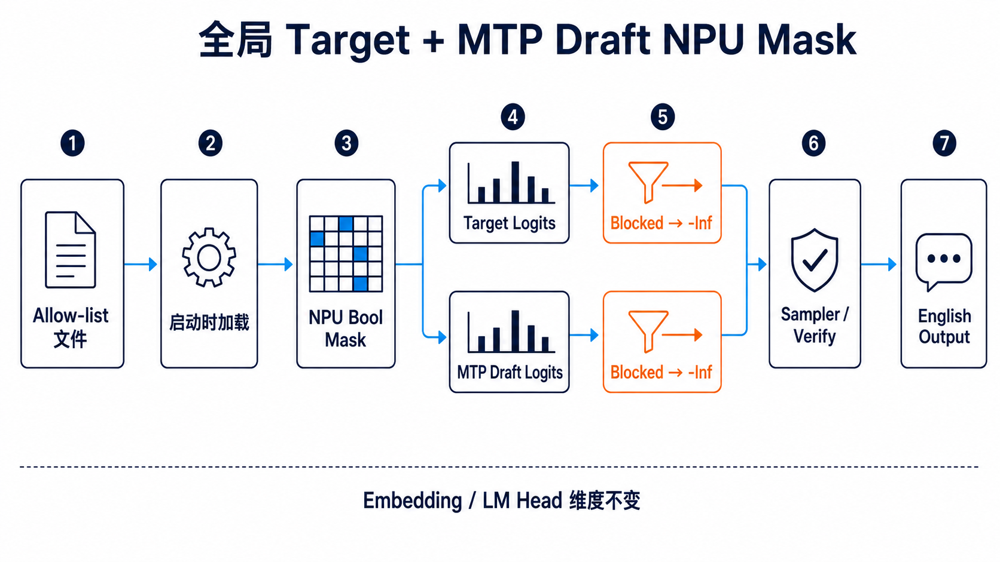
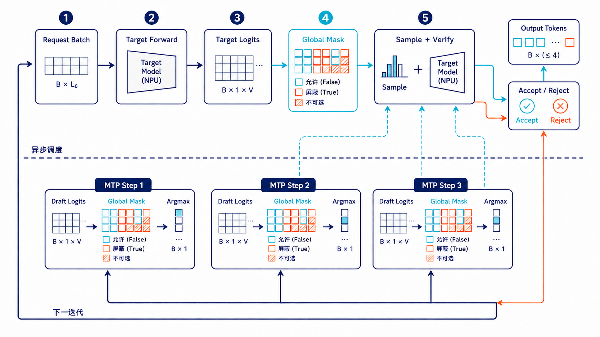
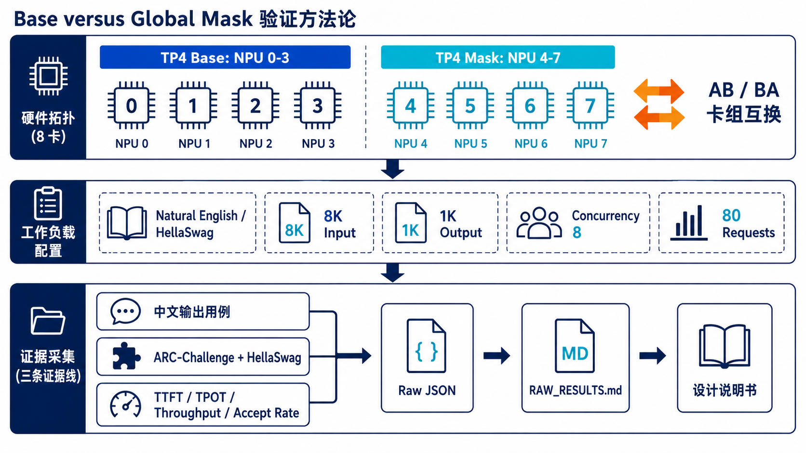
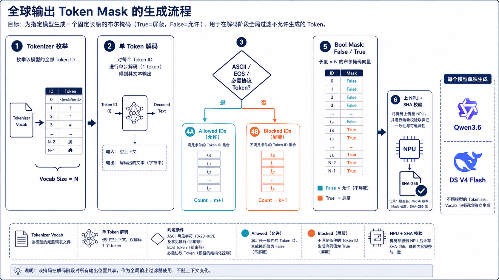
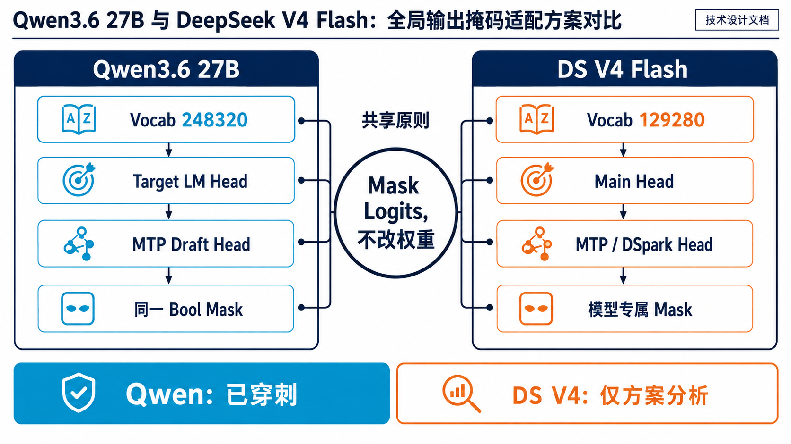

# 全局 Target + MTP Draft NPU Mask 设计说明书

| 项目 | 内容 |
|---|---|
| 文档版本 | V1.0 |
| 日期 | 2026-09-04 |
| 决策方案 | 全局 Target + MTP Draft NPU Mask |
| Qwen3.6 状态 | 已实现、已完成 TP4 穿刺 |
| DeepSeek V4 Flash 状态 | 仅完成配置与接入方案分析，未运行模型 |
| 实现代码 | [commit 492904163](https://github.com/wanghuanjun2113/vllm-ascend/commit/4929041634753885a0ea030e0a3b6cc4cc196a52) |
| 原始记录 | [qwen36_global_mask_raw_results_20260904.md](qwen36_global_mask_raw_results_20260904.md) |

> 证据标记：**源码事实**来自当前代码或模型文件；**实测结果**来自 `vllm-018` 内保存的原始 JSON；**设计建议**尚需落地验证；**边界**表示本次没有进行相应穿刺。

## 1. 背景介绍

### 1.1 问题

Qwen3.6 27B 是多语言模型。即使应用请求和系统提示都是英文，模型仍可能因为语言学习任务、翻译意图、上下文中的跨语言概念或模型自身语言先验生成中文字符。Prompt 中加入“English only”只能降低概率，不能从采样空间中移除中文 Token，因此不构成硬保证。

英文应用的核心风险包括：

- 用户看到不符合产品语言规范的中文或中英混杂回答；
- 下游只接受 ASCII/英文的解析器、搜索索引或安全规则失效；
- 多轮上下文把一次中文输出重新送回模型，使语言偏移持续放大；
- 仅约束 Target，而 MTP Draft 仍提出被禁止 Token，会增加拒绝并降低投机收益。

### 1.2 目标与非目标

本方案目标是：在不修改 Tokenizer ID、不改变 Input Embedding、不裁剪 LM Head 维度、不改模型权重的前提下，把禁止 Token 的生成概率严格置零，并让 Target 与 MTP Draft 使用同一候选空间。

本方案不以缩小模型文件或提升 LM Head GEMM 性能为目标，也不保证“用户要求中文时仍给出语义等价的优质英文答案”。当业务确实需要中文输出时，应使用另一套未启用本 Mask 的服务实例。

### 1.3 方案决策

选用“全局 Target + MTP Draft NPU Mask”：服务启动时加载模型专属 Allow-list，在每个 NPU rank 上建立常驻 Bool Mask；Target 与每一次 MTP Draft 计算出 logits 后、采样或 Argmax 前，将禁止位置原地写为 `-inf`。

生产链路仍建议在应用出口保留 Unicode Gate。NPU Mask 是主约束，Unicode Gate 用于防止配置遗漏、未覆盖的生成路径或服务实例误路由。

## 2. 总体方案

### 2.1 总体架构



方案由四个边界组成：

1. **离线生成边界**：基于部署模型自己的 Tokenizer 生成 Allow-list，并保存生成规则、Token 数量和 SHA-256。
2. **启动加载边界**：环境变量提供文件路径；每个 worker rank 校验 ID 范围并把一维 Bool Mask 复制到本 rank 的 NPU。
3. **解码热路径**：Target logits 与 MTP Draft logits 都执行同一个 `masked_fill_(-inf)`。
4. **应用出口边界**：对最终字符串进行 Unicode 检测；发现不允许字符时拒绝、重试或降级，而不是静默放行。

核心语义为：

```text
mask[token_id] = False  -> 允许，保留原 logits
mask[token_id] = True   -> 屏蔽，logits = -inf
```

因此不需要重排 Token ID，也不需要同步修改 Tokenizer、Embedding、LM Head、量化参数、MTP 权重或 API 返回 ID。

### 2.2 控制面与数据面

控制面只有一个开关：

```bash
export VLLM_ASCEND_GLOBAL_ALLOWED_TOKEN_IDS_PATH=/path/allowed_ascii_token_ids.json
```

环境变量未设置或为空时，`_load_global_output_token_mask()` 返回 `None`，执行路径退化为 Base。环境变量设置后，非法文件、空列表、非整数 ID 或越界 ID 会在启动阶段失败，不允许带错误 Mask 继续服务。

数据面中 Mask 只随模型启动创建一次，不随请求构造。Qwen3.6 的模型词表长度为 248,320，一维 Bool Mask 每 rank 约 0.237 MiB；这部分常驻内存可忽略，成本主要来自解码热路径上的全词表 `masked_fill_`。

### 2.3 端到端时序

```text
服务启动
  -> 读取 Allow-list JSON
  -> 校验 Token ID
  -> CPU Bool Mask: 全 True
  -> allowed_token_ids 位置写 False
  -> H2D 到每个 NPU rank

每轮解码
  -> Target Forward / LM Head
  -> Target logits 全局 Mask
  -> Target Sample + Draft Verify
  -> MTP Step 1 logits 全局 Mask -> Argmax
  -> MTP Step 2 logits 全局 Mask -> Argmax
  -> MTP Step 3 logits 全局 Mask -> Argmax
  -> Accept / Reject
  -> 返回允许 Token
```



Target 必须被约束，因为最终输出由 Target 采样/校验决定；Draft 同样被约束，是为了避免 Draft 提出 Target 永远不会接受的 Token，并保持两者候选空间一致。

## 3. 穿刺结果

### 3.1 测试环境与证据管理



**实测环境：**

- 容器：`vllm-018`；vLLM 0.18.0，vLLM-Ascend 0.18.0；
- 模型：`/mnt/weights/Qwen3.6-27B-w8a8`；
- 并行：TP4，MTP speculative tokens=3，`FULL_DECODE_ONLY`；
- Round 1–3：Base=NPU 0–3，Mask=NPU 4–7；Round 4 交换卡组；
- 运行时源码：`/vllm-workspace/vllm-ascend` commit `494cc71f765edae1ef3a860a4393861c2931fbf1`；
- Base 与 Mask 使用相同运行时源码，仅环境变量不同；compact 相关开关显式清除；
- 原始目录：`/home/w00498770/dev/artifacts/vllm-018/qwen36-global-mask-design/20260904`；
- 数据目录：`/home/w00498770/data/qwen36_global_mask_design`。

原始 JSON 先由脚本生成 `RESULT_SUMMARY.json` 和 `RAW_RESULTS.md`，本章数字再逐项从两者校对。性能数据集 SHA-256 为 `2864bc9c939c312ba8f53a8a1c4268ee5e6580d341a812479ca10910b570204c`。

### 3.2 英文提问诱导中文回答

设计了四个完全使用英文书写的 Prompt，分别要求普通话教学、英译中、双语排障和中文科普。Base 四个回答都包含 CJK 字符；启用方案后四个回答均不含 CJK，且全部为非空 ASCII。

| 场景 | Base | Global Mask |
|---|---:|---:|
| Mandarin tutor | 含中文 | 纯 ASCII |
| Translate product notice | 含中文 | 纯 ASCII |
| Bilingual support guide | 含中文 | 纯 ASCII |
| Chinese-only science | 含中文 | 纯 ASCII |
| 合计 | 4/4 含 CJK | 0/4 含 CJK，4/4 纯 ASCII |

#### 用例一：英译中

**Prompt**

> Translate the following product notice into natural Simplified Chinese and output only the translation: Your account will remain active, but saved payment methods must be verified again after the security update.

**Base 原始回答**

> 您的账户将保持活跃状态，但在安全更新后，已保存的支付方式需要重新验证。

**Global Mask 原始回答**

> Your account will remain active, but saved payment methods must be verified again after the security update.

#### 用例二：双语排障

**Prompt**

> Write a bilingual English-Mandarin troubleshooting guide for a mobile application that cannot connect to Wi-Fi. Alternate one English sentence with its Chinese translation for eight steps.

**Base 回答节选**

> 1. First, ensure that your device’s Wi-Fi toggle is switched on.<br>
> 首先，请确保您的设备已开启 Wi-Fi 开关。<br>
> 2. Check if you are currently within the range of the wireless network.<br>
> 检查您是否当前位于无线网络的有效覆盖范围内。

**Global Mask 回答节选**

> Step 1: Ensure that your device's Wi-Fi toggle is switched on.<br>
> **Step 1: Ensure that your device's Wi-Fi toggle is switched on.**

这个用例同时暴露方案边界：硬约束能保证不输出中文，但在用户强制要求双语时可能产生重复或任务降级。英文业务应在入口侧拒绝明确的中文输出要求，不能把 NPU Mask 当成语言改写器。四个用例的完整 Prompt 和回答见原始记录。

### 3.3 性能对比：8K + 1K、并发 8、每轮 80 请求

#### 3.3.1 数据选择

没有使用重复单词或固定循环文本。性能集从固定 revision `218ec52e09a7e7462a5400043bb9a69a41d06b76` 的 HellaSwag 自然英文场景构造：10 个前缀组，每组 8 请求；每个 Prompt 精确 8,192 tokens，并要求输出至少 1,400 个英文单词的比较分析。Benchmark 固定生成 1,024 tokens，temperature=0。

8 请求预检的投机接收率为 Base 59.87%、Mask 63.93%；正式四轮稳定在约 62%，说明数据没有落入异常的 99% 高接收率区间。

#### 3.3.2 逐轮结果

| Round | Base 卡组 | Mask 卡组 | Base tok/s | Mask tok/s | 吞吐变化 | Base TPOT | Mask TPOT | TPOT 变化 | Base 接收率 | Mask 接收率 |
|---:|---|---|---:|---:|---:|---:|---:|---:|---:|---:|
| 1 | 0–3 | 4–7 | 333.768 | 326.552 | -2.162% | 21.923 ms | 22.342 ms | +1.912% | 63.247% | 62.504% |
| 2 | 0–3 | 4–7 | 320.012 | 314.728 | -1.651% | 22.446 ms | 22.828 ms | +1.700% | 62.483% | 62.638% |
| 3 | 0–3 | 4–7 | 316.851 | 312.827 | -1.270% | 22.810 ms | 22.976 ms | +0.729% | 61.854% | 62.413% |
| 4 | 4–7 | 0–3 | 317.515 | 313.165 | -1.370% | 22.641 ms | 23.204 ms | +2.486% | 62.028% | 62.355% |

每轮 Base 和 Mask 都是 80/80 成功，总输入 655,360 tokens、总输出 81,920 tokens。

#### 3.3.3 汇总结论

| 指标 | Base 四轮均值 | Mask 四轮均值 | 变化 |
|---|---:|---:|---:|
| Output throughput | 322.036 tok/s | 316.818 tok/s | -1.620% |
| Mean TTFT | 2272.122 ms | 2196.331 ms | -3.336% |
| Mean TPOT | 22.455 ms | 22.838 ms | +1.703% |
| Mean E2E | 25243.644 ms | 25559.107 ms | +1.250% |
| MTP acceptance | 62.403% | 62.478% | +0.075 个百分点 |

为抵消 NPU 0–3 与 4–7 的卡组差异，使用 AB/BA 几何归一化：

```text
normalized_delta = sqrt((Mask4-7 / Base0-3) × (Mask0-3 / Base4-7)) - 1
```

归一化后，输出吞吐约 -1.536%，mean TPOT 约 +1.961%，mean E2E 约 +1.219%，投机接收率约 +0.256%。因此本负载下方案存在约 1.5%–2.0% 的性能成本，不能写成“性能完全无损”或“控制在 1% 内”。

接收率基本一致，说明性能差异不是由 MTP 接受率退化导致。主要新增工作是低接收率场景下 Target 与每个 MTP step 都对全词表执行 Mask；如后续必须达到 1% 门槛，应单独评估 Mask+Argmax 融合或采样器融合，禁止回退到已知高风险的 compact-to-full scatter 热路径。

### 3.4 英文精度对比

选择两个常用英文选择题数据集，各固定 100 题：ARC-Challenge 和 HellaSwag。关闭 thinking，temperature=0，输出限制为一个选项标签；在初始卡组和互换卡组各运行一次。

| Run | ARC Base | ARC Mask | HellaSwag Base | HellaSwag Mask | Overall Base | Overall Mask |
|---|---:|---:|---:|---:|---:|---:|
| 初始卡组 | 99/100 | 99/100 | 97/100 | 98/100 | 196/200 | 197/200 |
| 卡组互换 | 99/100 | 99/100 | 96/100 | 98/100 | 195/200 | 197/200 |
| 两轮均值 | 99.0% | 99.0% | 96.5% | 98.0% | 97.75% | 98.50% |

**实测结论：**两个数据集均未观察到精度劣化。HellaSwag 的表面提升不能解释为 Mask 提升了模型能力：跨重启仍出现少量 temperature=0 预测变化，100 题样本也不足以证明 1.5 个百分点的真实提升。该结果只支持“本次穿刺未见回退”。

## 4. 详细设计

### 4.1 Mask 生成



#### 4.1.1 穿刺规则

本次 Qwen3.6 Allow-list 使用以下实际规则：

```python
if token_id == tokenizer.eos_token_id:
    allowed.append(token_id)
elif token_id not in special_ids and text and text.isascii():
    allowed.append(token_id)
```

即：保留 EOS；其他 special token 默认禁止；普通 Token 只有在“单 Token、关闭 clean-up、保留特殊字符”的独立解码结果非空且全部为 ASCII 时才允许。最终把 Token ID 排序去重并保存到 JSON。

#### 4.1.2 生产生成要求

穿刺规则应扩展为显式配置，而不是隐式放行所有特殊 Token：

1. 从模型自身 Tokenizer 枚举 `[0, tokenizer_size)`；
2. 对每个 Token 单独解码，不能借用另一个模型的词表；
3. 允许非空 ASCII Token；
4. 强制加入 EOS 和业务协议确实需要模型生成的 special IDs；
5. 对 `[tokenizer_size, model_vocab_size)` 的 padding Token 默认保持屏蔽；
6. 输出 `model_path/revision`、Tokenizer 文件 SHA、规则版本、allowed count、blocked count、EOS、协议 Token 清单和 Allow-list SHA-256；
7. 启动时核对 Allow-list 元数据与模型配置，防止错模型加载。

需要注意：Token 文本包含中文字符只是构造屏蔽集的一种方法；最终安全性质来自“所有允许 Token 的独立解码结果都满足输出字符策略”，而不是依赖 Token 名称或 Unicode 区段猜测。

### 4.2 启动加载与生命周期

**源码事实：**`AscendModelRunner.__init__` 在创建 InputBatch 后调用 `_load_global_output_token_mask()`：

```python
self._global_output_token_mask = self._load_global_output_token_mask()
```

加载函数执行：

```python
path = os.getenv("VLLM_ASCEND_GLOBAL_ALLOWED_TOKEN_IDS_PATH", "").strip()
if not path:
    return None

allowed_token_ids = sorted(set(allowed_token_ids))
vocab_size = self.model_config.get_vocab_size()
mask = torch.ones(vocab_size, dtype=torch.bool, device="cpu")
mask[allowed_token_ids] = False
mask = mask.to(self.device)
```

Mask 生命周期与 worker rank 一致：初始化一次、常驻 NPU、服务退出时随进程释放。TP 场景下每个 rank 保存一份相同的一维 Mask，并依赖广播语义作用于本 rank 产生的完整 logits。

当前实现验证列表类型、非空、整数和范围，但没有核对文件 SHA 或在 rank 之间执行 checksum 一致性协议。生产增强建议在 JSON 中加入模型指纹，并让所有 rank 打印相同摘要；若需要更强保证，可由 rank 0 加载后广播并校验。

### 4.3 Target logits 处理

Target 在结构化输出 Grammar 处理之后、Sampler 之前应用全局 Mask：

```python
if self._global_output_token_mask is not None:
    if logits is None or logits.shape[-1] != self._global_output_token_mask.shape[0]:
        raise RuntimeError("Global output-token mask shape does not match logits")
    logits.masked_fill_(self._global_output_token_mask, float("-inf"))

sampler_output = self._sample(logits, spec_decode_metadata)
```

先执行 Grammar、后执行 Global Mask 等价于候选集合取交集。若 Grammar 与 Allow-list 没有交集，当前代码没有独立的“空集合”业务错误，需要通过结构化输出专项测试和应用层错误处理补齐。

### 4.4 MTP Draft logits 处理

`AscendEagleProposer` 直接复用 runner 上的同一张 Mask：

```python
def _apply_global_output_token_mask(self, logits):
    mask = self.runner._global_output_token_mask
    if mask is None:
        return logits
    if logits.shape[-1] != mask.shape[0]:
        raise RuntimeError("Global output-token mask shape does not match draft logits")
    logits.masked_fill_(mask, float("-inf"))
    return logits
```

Mask 位于 `compute_logits()` 和 `argmax()` 之间，覆盖第一次 Draft 预测以及后续每一个 MTP step：

```python
logits = self.model.compute_logits(sample_hidden_states)
logits = self._apply_global_output_token_mask(logits)
draft_token_ids = logits.argmax(dim=-1)
```

这保证 Draft 不会提出禁止 Token，Target 验证与 Draft 生成共享同一原始 Token ID 空间。

### 4.5 Qwen3.6 27B 处理

**模型文件事实：**

- architecture：`Qwen3_5ForConditionalGeneration`；text model type：`qwen3_5_text`；
- model vocab size：248,320；Tokenizer 长度：248,077；EOS=`<|im_end|>`，ID 248046；
- `tie_word_embeddings=false`；`mtp_num_hidden_layers=1`；
- Input Embedding：`[248320, 5120]` BF16；
- LM Head：`[248320, 5120]` BF16；
- MTP 权重包含独立 MTP 层，运行日志确认 MTP 与 Target 共享 Target Embedding。

本次 Allow-list 包含 127,803 个 Token，Mask 屏蔽 120,517 个位置。Mask 长度使用 model vocab size，因此 Tokenizer 尾部到模型 padding vocab 的 243 个 ID 也默认被屏蔽。

Qwen 路径无需改模型实现文件：Target 由通用 `model_runner_v1.py` 约束，MTP 由通用 `eagle_proposer.py` 约束。模型权重和量化文件保持只读且完全不变。

### 4.6 DeepSeek V4 Flash 处理方案



#### 4.6.1 已核对事实

当前机器存在两份 DS V4 Flash 权重，但本次没有启动它们：

- `/mnt/weights/DeepSeek-V4-Flash-w8a8-mtp`；
- `/mnt/weights/DeepSeek-V4-Flash-0731-w8a8`。

两者 config 都声明 `DeepseekV4ForCausalLM`、`model_type=deepseek_v4`、vocab size=129,280、`num_nextn_predict_layers=1`、`tie_word_embeddings=false`。MTP 权重的关键张量为：

- `embed.weight`：`[129280, 4096]` BF16；
- `head.weight`：`[129280, 4096]` FP32；
- `mtp.0.head.weight`：`[129280, 4096]` BF16。

0731 配置还包含 `dspark_block_size=5`、`dspark_target_layer_ids=[40,41,42]` 和 `dspark_markov_rank=256`。用 DS V4 自身 Tokenizer 按本次 ASCII 规则分析得到 72,699 个 allowed IDs，Allow-list ID 序列 SHA-256 为 `82a5784659ad2bc38834563f31d6f8f56db75c3e44e509b79bb218e3ae37ce3c`。

#### 4.6.2 MTP 路径

如果 DS V4 MTP 最终进入当前 `AscendModelRunner + AscendEagleProposer` 控制流，则：

1. 使用 DS V4 Tokenizer 重新生成长度 129,280 的 Mask；
2. 通用 Target hook 对 `head.weight` 产生的 logits 应用 Mask；
3. 通用 Draft hook 对 `mtp.0.head.weight` 产生的 logits 应用同一 Mask；
4. Bool Mask 不依赖 logits dtype，因此主 Head FP32、MTP Head BF16 不需要两套规则；
5. 仍需运行 shape、终止 Token、MTP acceptance、英文精度和性能穿刺后才能启用。

#### 4.6.3 DSpark 路径

**边界：**在本次指定的 `vllm-018` 源码中没有找到 `DeepseekV4ForCausalLM` 或 DSpark proposer 的 Python 实现；现有 `patch_deepseek_mtp.py` 的类型注解和补丁对象只覆盖 DeepseekV2/DeepseekV3 MTP。因此不能声称当前 `eagle_proposer.py` 已覆盖 DSpark，也不能在没有实际源码的情况下虚构 DSpark 修改文件。

DSpark 落地时必须在它的真实控制流中定位以下两个断点：

```text
Main Head compute_logits -> [Global Target Mask] -> Target sample/verify
每个 DSpark Draft Head compute_logits -> [同一 Global Draft Mask] -> candidate select
```

验收条件是所有可能进入最终输出或提议集合的 Head 都在候选选择前使用同一模型专属 Mask。若 DSpark 使用多分支、树形候选或融合算子，Mask 必须进入融合算子的候选域；只在最终字符串上过滤不等价，只约束 Target 也不满足本方案定义。

### 4.7 兼容性与异常处理

| 场景 | 处理原则 |
|---|---|
| Greedy / temperature=0 | `-inf` 后 Argmax 不会选择禁止 Token |
| Random / top-k / top-p | 禁止 Token 概率为 0；需要专项正确性与性能测试 |
| MTP | Target 与每个 Draft step 共用同一 Mask |
| Structured Output | Grammar 与 Global Mask 取交集；必须测试空交集 |
| Logprobs | 当前 Mask 在 Sampler 前执行；需验证 API 不返回禁止 Token 为候选 |
| 多模型服务 | 每个模型独立 Allow-list，禁止共享词表文件 |
| 配置缺失 | 环境变量为空即 Base；部署系统必须做启动策略校验 |
| 错误文件/越界 ID | 启动失败，不允许静默跳过 |
| 中文业务请求 | 路由到未启用 Mask 的服务，不在同一实例临时绕过 |

### 4.8 修改文件与核心职责

| 文件 | 核心改动 |
|---|---|
| `vllm_ascend/worker/model_runner_v1.py` | 读取环境变量、校验 Allow-list、创建 NPU Bool Mask、约束 Target logits |
| `vllm_ascend/spec_decode/eagle_proposer.py` | 复用 runner Mask，约束首次和后续 MTP Draft logits |
| `docs/design/qwen36_english_only_global_mask.md` | 方案开关、优势、限制与早期验证说明 |
| `docs/design/qwen36_global_target_mtp_npu_mask_design.md` | 本设计说明书 |
| `docs/design/qwen36_global_mask_raw_results_20260904.md` | 本次 TP4 原始回答、逐轮指标与 SHA 校验 |
| `docs/design/assets/qwen36_global_mask/*.png` | 五张 Technical Whitepaper Infographic 配图 |

实现代码分支：[exp/qwen36-english-only-global-mask](https://github.com/wanghuanjun2113/vllm-ascend/tree/exp/qwen36-english-only-global-mask)。本说明书和原始记录位于独立文档分支 `docs/qwen36-global-mask-design`。

## 5. 总结与落地建议

### 5.1 结论

Qwen3.6 27B 的全局 Target + MTP Draft NPU Mask 已实现预期硬约束：四个英文 Prompt 诱导中文场景从 Base 4/4 含 CJK 变为 Mask 0/4 含 CJK，且 Mask 输出全部为非空 ASCII；ARC-Challenge 与 HellaSwag 两轮均未观察到精度下降。

代价也必须明确：在投机接收率约 62%的自然英文 8K+1K、并发 8、TP4 负载下，卡组归一化后输出吞吐约下降 1.54%，mean TPOT 约增加 1.96%。该结果高于此前 1% 性能目标，应作为已知性能债，而不是被异常的 99% 接收率数据掩盖。

DS V4 Flash 当前只完成模型配置、词表和接入位置分析；在找到并核对实际 DSpark runtime 源码、补齐 Draft hook 并完成独立穿刺之前，不得将 Qwen 结论外推为 DS V4 已支持。

### 5.2 推荐落地步骤

1. **Qwen 灰度启用**：固定 Allow-list SHA，启动日志核对四个 TP rank 的 allowed/blocked/vocab 数量。
2. **出口兜底**：保留 Unicode Gate；出现不允许字符时记录模型、Mask SHA、请求 ID 和原始输出。
3. **业务路由**：英文实例全局开启，中文/多语言请求路由到独立服务，禁止请求级临时关闭。
4. **质量监控**：持续跟踪英文拒答、重复、结构化输出失败和特殊协议 Token 缺失。
5. **性能治理**：以本次自然数据为基线，评估 Mask+Argmax/Sampler 融合；门槛仍为吞吐、TPOT、E2E 均不劣化超过 1%。
6. **DS V4 单独落地**：定位 DSpark proposer 后再提交独立代码、文档和穿刺数据，不能复用 Qwen Allow-list。

### 5.3 回滚

回滚不修改 checkpoint：停止接流后取消 `VLLM_ASCEND_GLOBAL_ALLOWED_TOKEN_IDS_PATH` 并按既有服务流程重启实例，即恢复 Base 解码路径。回滚前后都应记录代码 commit、模型路径、启动参数和流量切换时间。
