# FlashComm1 设计说明

## 概述

FlashComm1 在 vLLM Ascend 代码中通常简称为 FC1，是面向 Ascend NPU 张量并行推理的通信优化。它的核心思想是：把层与层之间的 hidden states 从“每个 TP rank 都保存完整 sequence”改成“每个 TP rank 只保存 sequence 维的一段”。

```text
不开 FC1:
  每个 TP rank 保存 [S, H]

开启 FC1，TP = N:
  层间每个 TP rank 保存 [S / N, H]
```

对 Dense 模型来说，FC1 会把很多 row-parallel 边界上的 `all_reduce` 改成 `reduce_scatter`，并且只在 column-parallel 层真正需要完整 sequence 输入之前再做 `all_gather`。对 MoE 模型来说，FC1 仍然维持 sequence-sharded 的层间 hidden states，但 FFN 部分由 routed experts 的 dispatch/combine 完成，而不是 Dense 模型里的 `gate_up_proj/down_proj`。

启用方式：

```bash
export VLLM_ASCEND_ENABLE_FLASHCOMM1=1
```

为了兼容旧配置，`VLLM_ASCEND_ENABLE_FLASHCOMM=1` 也仍然会被识别。

## 生效逻辑

运行时是否启用 FC1 记录在 `forward_context.flash_comm_v1_enabled` 中。

Dense 主模型：

```text
flash_comm_v1_enabled =
  enable_sp(vllm_config) and num_tokens is not None and num_tokens > 1000
```

MoE 主模型：

```text
flash_comm_v1_enabled =
  enable_sp(vllm_config) and num_tokens is not None
```

Dense 路径有 `num_tokens > 1000` 的阈值，是因为 FC1 会引入额外的集合通信边界。小 batch 或 decode 阶段 token 数很少时，通信固定开销可能超过节省下来的计算和访存收益。

FC1 开启后，forward context 中还会记录这些关键状态：

```text
pad_size: 将 token 数 pad 到 TP size 的倍数
mmrs_fusion: 是否为支持的 Dense row-parallel 层启用 Matmul + ReduceScatter 融合
padded_num_tokens: MC2 和相关 MoE 路径使用的 padded token 数
mc2_mask: MoE padded token 的有效 token mask
```

## Dense 模型流程

以下用 Qwen3.5-27B TP4 举例：

```text
S = 4096
TP = 4
intermediate_size = 17408
每个 rank 的 sequence shard = 1024 tokens
```

### 不开启 FC1



```mermaid
flowchart LR
    A["hidden<br/>每 rank: [4096,H]"]
    A --> B["Attn RMSNorm<br/>[4096,H]"]
    B --> C["qkv_proj<br/>Column Parallel<br/>[4096,H] -> QKV shard"]
    C --> D["Attention<br/>简略表示"]
    D --> E["o_proj<br/>Row Parallel<br/>局部输出 [4096,H]"]
    E --> F["AllReduce"]
    F --> G["Attention 后 hidden<br/>每 rank: [4096,H]"]

    G --> H["FFN RMSNorm<br/>[4096,H]"]
    H --> I["gate_up_proj<br/>Column Parallel<br/>[4096,H] -> [4096,2*17408/4]"]
    I --> J["SwiGLU / Activation<br/>[4096,17408/4]"]
    J --> K["down_proj<br/>Row Parallel<br/>局部输出 [4096,H]"]
    K --> L["AllReduce"]
    L --> M["下一层 hidden<br/>每 rank: [4096,H]"]
```

不开 FC1 时，每个 rank 始终持有完整 sequence。RMSNorm、residual 处理和 activation 相关的访存都会在所有 TP rank 上对完整 token 重复执行。

### 开启 FC1



```mermaid
flowchart LR
    A["hidden<br/>层间每 rank: [1024,H]"]
    A --> B["Attn RMSNorm<br/>只处理 [1024,H]"]
    B --> C["AllGather<br/>[1024,H] x 4 -> [4096,H]"]
    C --> D["qkv_proj<br/>Column Parallel<br/>[4096,H] -> QKV shard"]
    D --> E["Attention<br/>简略表示"]
    E --> F["o_proj<br/>Row Parallel<br/>局部输出 [4096,H]"]
    F --> G["ReduceScatter<br/>或 Matmul+ReduceScatter"]
    G --> H["Attention 后 hidden<br/>每 rank: [1024,H]"]

    H --> I["FFN RMSNorm<br/>只处理 [1024,H]"]
    I --> J["AllGather<br/>[1024,H] x 4 -> [4096,H]"]
    J --> K["gate_up_proj<br/>Column Parallel<br/>[4096,H] -> [4096,2*17408/4]"]
    K --> L["SwiGLU / Activation<br/>[4096,17408/4]"]
    L --> M["down_proj<br/>Row Parallel<br/>局部输出 [4096,H]"]
    M --> N["ReduceScatter<br/>或 Matmul+ReduceScatter"]
    N --> O["下一层 hidden<br/>每 rank: [1024,H]"]
```

两条路径的关键差异是层间 hidden states 的形态：

```text
不开 FC1:
  o_proj/down_proj -> all_reduce -> 每个 rank 都得到 [S, H]

开启 FC1:
  o_proj/down_proj -> reduce_scatter -> 每个 rank 得到 [S / TP, H]
  qkv_proj/gate_up_proj 前 -> all_gather -> 每个 rank 临时恢复 [S, H]
```

`gate_up_proj` 通常是 merged column-parallel projection。对 Qwen3.5-27B 来说：

```text
gate_up_proj 每 rank 输出:
  [4096, 2 * 17408 / 4] = [4096, 8704]

SwiGLU 后:
  [4096, 17408 / 4] = [4096, 4352]

down_proj 每 rank 局部输出:
  [4096, H]
```

FC1 改变的是 `down_proj` 后的通信方式：从 `all_reduce` 改成 `reduce_scatter`，所以下一层开始时每个 rank 只持有 `[1024, H]`。

## Dense 场景收益来源

### 1. RMSNorm 和 residual 处理量减少

Dense transformer block 中通常有两次 RMSNorm 或 AddRMSNorm。不开 FC1 时，每个 TP rank 都处理完整 `[S, H]`。TP4 开启 FC1 后，row-parallel 和 column-parallel 层之间每个 rank 只处理 `[S / 4, H]`。

以 `S = 4096` 为例：

```text
不开 FC1，每 rank norm 输入:
  [4096, H]

开启 FC1，每 rank norm 输入:
  [1024, H]
```

### 2. 层间 activation 访存降低

层间 hidden states 和 residual tensor 会按 sequence 维切分：

```text
不开 FC1:
  hidden/residual 每 rank: [4096, H]

开启 FC1:
  hidden/residual 每 rank: [1024, H]
```

这会降低大 batch prefill 场景下的 activation 显存占用和内存带宽压力。

### 3. 量化场景下通信位置更有利

理想的数据流是：

```text
reduce_scatter -> RMSNorm -> Quant -> all_gather
```

如果 all-gather 前已经完成量化，通信传输的数据量就可能更小。例如传 INT8 而不是 BF16，通信字节数可以明显下降。

### 4. Matmul + ReduceScatter 融合

对支持的 Dense row-parallel 层，FC1 可以使用下面的融合算子把 local matmul 和 reduce-scatter 融合起来：

```python
torch_npu.npu_mm_reduce_scatter_base(...)
```

该逻辑在 `SequenceRowParallelOp.matmul_and_reduce()` 中使用，典型层包括：

```text
o_proj
out_proj
down_proj
attention.dense
```

融合算子支持情况：

```text
UnquantizedLinearMethod:
  支持 npu_mm_reduce_scatter_base

Ascend W8A8:
  支持 quantize + npu_mm_reduce_scatter_base

其他量化方法:
  保留 FC1 的 reduce_scatter 语义，但退化为 matmul 后再 reduce_scatter
```

不满足融合条件时，执行路径会退化为：

```text
quant_method.apply(...)
tensor_model_parallel_reduce_scatter(...)
```

## MoE 模型流程

MoE 模型中，FC1 仍然保持层间 hidden states 按 sequence 维切分，但 FFN block 变成 routed expert computation，不再是 Dense 的 `gate_up_proj/down_proj`。

### 不开启 FC1

```text
hidden 每 rank: [S, H]

Attention:
  qkv / attention / o_proj
  o_proj -> all_reduce
  输出每 rank: [S, H]

MoE:
  RMSNorm 处理 [S, H]
  router/topk 处理 [S, num_experts]
  token dispatch 到 expert 所在 rank
  本地 expert grouped matmul
  token combine 恢复原 token 顺序
  输出每 rank: [S, H]
```

### 开启 FC1

```text
层间 hidden 每 rank: [S / TP, H]

Attention:
  RMSNorm 只处理本地 sequence shard
  qkv 前按需 all_gather
  o_proj -> reduce_scatter
  输出每 rank: [S / TP, H]

MoE:
  RMSNorm 处理 [S / TP, H]
  router/topk 只处理本地 token shard
  MoE prepare 执行 pad/slice，并在需要时构造 mc2_mask
  token dispatch 将 routed tokens 发送到 expert rank
  本地 expert grouped matmul
  token combine 合并 expert 输出
  finalize 保持或恢复 FC1 的 sequence-sharded 层间形态
```

和 Dense FC1 相比，MoE FC1 通常不应该在 FFN 前恢复完整 `[S, H]`。每个 TP rank 只路由自己那一段 token，expert 的放置和 token 移动由 MoE 通信机制处理。

## MC2 与 FC1 的区别

MC2 是另一类 MoE 通信优化。它通过 `MoECommType` 选择，并且不会用于 Dense-only 模型。

```text
if not is_moe_model(vllm_config):
  moe_comm_type = None
```

两者的概念差异如下：

```text
FC1:
  优化 tensor-parallel 的层间通信边界。
  将 all_reduce 改成 reduce_scatter + 延迟 all_gather。
  让层间 hidden states 保持 sequence-sharded。

MC2:
  优化 MoE token routing。
  使用 Ascend dispatch/combine 算子把 token 发送到 expert rank，
  再把 expert 输出合并回来。
```

MC2 核心算子：

```text
torch_npu.npu_moe_distribute_dispatch
torch_npu.npu_moe_distribute_dispatch_v2
torch_npu.npu_moe_distribute_combine
torch_npu.npu_moe_distribute_combine_v2
```

Fused MC2 可以进一步替换完整的 dispatch、expert MLP 和 combine 流程：

```text
VLLM_ASCEND_ENABLE_FUSED_MC2=1:
  dispatch_ffn_combine

VLLM_ASCEND_ENABLE_FUSED_MC2=2:
  dispatch_gmm_combine_decode
```

| 维度 | FC1 | MC2 |
| --- | --- | --- |
| 主要目标 | TP Dense 和层间通信边界 | MoE routed expert 通信 |
| 适用模型 | Dense 和 MoE | 仅 MoE |
| 通信组 | TP group | MC2 / EP-like group |
| 数据移动 | sequence shard 和延迟 all-gather | 按 expert dispatch/combine token |
| 替换对象 | all_reduce 边界 | all-gather/all-to-all expert routing |
| Dense Qwen3.5-27B TP4 | 适用 | 不适用 |

## 总结

FC1 可以概括为 sequence-parallel 的层间执行方式：

```text
RowParallel 输出:
  all_reduce -> reduce_scatter

层间 hidden:
  每 rank 完整 sequence -> 每 rank sequence shard

ColumnParallel 输入:
  只有需要完整 sequence 时才 all_gather
```

对 Dense 模型，主要收益来自更小的 RMSNorm/residual/quant 工作量、更低的 activation 访存压力，以及 Matmul + ReduceScatter 融合。对 MoE 模型，FC1 继续保持 sequence-sharded 的层间形态，而 routed expert 通信负责 token 移动。MC2 可以和 MoE 场景下的 FC1 互补，但它解决的是另一个问题：expert token 的 dispatch 和 combine。
