# FlashComm1 Design Notes

## Overview

FlashComm1, also called FC1 in vLLM Ascend code, is an Ascend-specific communication optimization for tensor parallel inference. Its main idea is to change the layer-to-layer hidden state layout from full sequence on every rank to sequence-sharded hidden states:

```text
Without FC1:
  each TP rank keeps [S, H]

With FC1 and TP = N:
  each TP rank keeps [S / N, H] between layers
```

For Dense models, FC1 replaces many row-parallel `all_reduce` boundaries with `reduce_scatter`, then performs `all_gather` only before column-parallel layers that need full sequence input. For MoE models, FC1 keeps the same sequence-sharded layer boundary, but the FFN part is handled through routed expert dispatch and combine instead of Dense `gate_up_proj/down_proj`.

The feature is enabled by:

```bash
export VLLM_ASCEND_ENABLE_FLASHCOMM1=1
```

The legacy environment variable `VLLM_ASCEND_ENABLE_FLASHCOMM=1` is still accepted for compatibility.

## Enable Logic

The runtime flag is stored in `forward_context.flash_comm_v1_enabled`.

For Dense main models:

```text
flash_comm_v1_enabled =
  enable_sp(vllm_config) and num_tokens is not None and num_tokens > 1000
```

For MoE main models:

```text
flash_comm_v1_enabled =
  enable_sp(vllm_config) and num_tokens is not None
```

The Dense path has a token threshold because FC1 adds collective communication boundaries. For small decode batches, the fixed communication overhead can exceed the saved computation and memory traffic.

When FC1 is enabled, the context also records:

```text
pad_size: pad token count to a multiple of TP size
mmrs_fusion: enable Matmul + ReduceScatter fusion for supported Dense row-parallel layers
padded_num_tokens: padded token count used by MC2 and related MoE paths
mc2_mask: active-token mask for padded MoE communication
```

## Dense Model Flow

Use Qwen3.5-27B TP4 as an example:

```text
S = 4096
TP = 4
intermediate_size = 17408
per-rank sequence shard = 1024 tokens
```

### Without FC1



```mermaid
flowchart LR
    A["hidden<br/>per rank: [4096,H]"]
    A --> B["Attn RMSNorm<br/>[4096,H]"]
    B --> C["qkv_proj<br/>Column Parallel<br/>[4096,H] -> QKV shard"]
    C --> D["Attention<br/>simplified"]
    D --> E["o_proj<br/>Row Parallel<br/>local output [4096,H]"]
    E --> F["AllReduce"]
    F --> G["attn output<br/>per rank: [4096,H]"]

    G --> H["FFN RMSNorm<br/>[4096,H]"]
    H --> I["gate_up_proj<br/>Column Parallel<br/>[4096,H] -> [4096,2*17408/4]"]
    I --> J["SwiGLU / Activation<br/>[4096,17408/4]"]
    J --> K["down_proj<br/>Row Parallel<br/>local output [4096,H]"]
    K --> L["AllReduce"]
    L --> M["next layer hidden<br/>per rank: [4096,H]"]
```

Each rank always has full sequence hidden states. RMSNorm, residual processing, and activation-side memory traffic are repeated on all TP ranks for all tokens.

### With FC1



```mermaid
flowchart LR
    A["hidden<br/>layer boundary per rank: [1024,H]"]
    A --> B["Attn RMSNorm<br/>only [1024,H]"]
    B --> C["AllGather<br/>[1024,H] x 4 -> [4096,H]"]
    C --> D["qkv_proj<br/>Column Parallel<br/>[4096,H] -> QKV shard"]
    D --> E["Attention<br/>simplified"]
    E --> F["o_proj<br/>Row Parallel<br/>local output [4096,H]"]
    F --> G["ReduceScatter<br/>or Matmul+ReduceScatter"]
    G --> H["attn output<br/>per rank: [1024,H]"]

    H --> I["FFN RMSNorm<br/>only [1024,H]"]
    I --> J["AllGather<br/>[1024,H] x 4 -> [4096,H]"]
    J --> K["gate_up_proj<br/>Column Parallel<br/>[4096,H] -> [4096,2*17408/4]"]
    K --> L["SwiGLU / Activation<br/>[4096,17408/4]"]
    L --> M["down_proj<br/>Row Parallel<br/>local output [4096,H]"]
    M --> N["ReduceScatter<br/>or Matmul+ReduceScatter"]
    N --> O["next layer hidden<br/>per rank: [1024,H]"]
```

The key difference is the layer boundary:

```text
Without FC1:
  o_proj/down_proj -> all_reduce -> each rank has [S, H]

With FC1:
  o_proj/down_proj -> reduce_scatter -> each rank has [S / TP, H]
  before qkv_proj/gate_up_proj -> all_gather -> each rank temporarily has [S, H]
```

`gate_up_proj` is usually a merged column-parallel projection. For Qwen3.5-27B:

```text
gate_up_proj output per rank:
  [4096, 2 * 17408 / 4] = [4096, 8704]

after SwiGLU:
  [4096, 17408 / 4] = [4096, 4352]

down_proj local output:
  [4096, H]
```

FC1 changes the communication after `down_proj` from `all_reduce` to `reduce_scatter`, so the next layer starts from `[1024, H]` on each rank.

## Dense Benefit Sources

### 1. Less RMSNorm and residual work

Dense transformer blocks usually have two RMSNorm or AddRMSNorm boundaries. Without FC1, every TP rank processes full `[S, H]`. With TP4 FC1, every rank processes only `[S / 4, H]` between row-parallel and column-parallel layers.

For `S = 4096`:

```text
Without FC1 per-rank norm input:
  [4096, H]

With FC1 per-rank norm input:
  [1024, H]
```

### 2. Less layer-boundary activation traffic

Layer-boundary hidden states and residual tensors are sequence-sharded:

```text
Without FC1:
  hidden/residual per rank: [4096, H]

With FC1:
  hidden/residual per rank: [1024, H]
```

This reduces activation memory footprint and memory bandwidth pressure in large prefill batches.

### 3. Better communication position for quantized models

The intended sequence is:

```text
reduce_scatter -> RMSNorm -> Quant -> all_gather
```

When quantization is available before all-gather, communication can move fewer bytes, for example INT8 instead of BF16.

### 4. Matmul + ReduceScatter fusion

For supported Dense row-parallel layers, FC1 can fuse local matmul and reduce-scatter with:

```python
torch_npu.npu_mm_reduce_scatter_base(...)
```

This is used in `SequenceRowParallelOp.matmul_and_reduce()` for layers such as:

```text
o_proj
out_proj
down_proj
attention.dense
```

Supported fusion paths:

```text
UnquantizedLinearMethod:
  supported by npu_mm_reduce_scatter_base

Ascend W8A8:
  supported by quantize + npu_mm_reduce_scatter_base

Other quantization methods:
  keep FC1 reduce_scatter semantics but fall back to matmul followed by reduce_scatter
```

For unsupported cases, the implementation falls back to:

```text
quant_method.apply(...)
tensor_model_parallel_reduce_scatter(...)
```

## MoE Model Flow

In MoE models, FC1 still keeps layer boundaries sequence-sharded, but the FFN block is routed expert computation instead of Dense `gate_up_proj/down_proj`.

### Without FC1

```text
hidden per rank: [S, H]

Attention:
  qkv / attention / o_proj
  o_proj -> all_reduce
  output per rank: [S, H]

MoE:
  RMSNorm over [S, H]
  router/topk over [S, num_experts]
  token dispatch to expert ranks
  local expert grouped matmul
  token combine to original token order
  output per rank: [S, H]
```

### With FC1

```text
hidden layer boundary per rank: [S / TP, H]

Attention:
  RMSNorm on local sequence shard
  all_gather before qkv when needed
  o_proj -> reduce_scatter
  output per rank: [S / TP, H]

MoE:
  RMSNorm on [S / TP, H]
  router/topk only for local token shard
  MoE prepare pads/slices and builds mc2_mask if needed
  token dispatch sends routed tokens to expert ranks
  local expert grouped matmul
  token combine merges expert outputs
  finalize keeps or restores the FC1 sequence-sharded boundary
```

Compared with Dense FC1, MoE FC1 usually should not restore full `[S, H]` before the FFN. Each TP rank routes its local token shard, and MoE communication handles expert placement.

## MC2 Compared With FC1

MC2 is a separate MoE communication optimization. It is selected through `MoECommType` and is not used for Dense-only models.

```text
if not is_moe_model(vllm_config):
  moe_comm_type = None
```

The conceptual difference is:

```text
FC1:
  Optimizes tensor-parallel layer boundaries.
  Changes all_reduce into reduce_scatter + delayed all_gather.
  Keeps layer hidden states sequence-sharded.

MC2:
  Optimizes MoE token routing.
  Uses Ascend dispatch/combine operators to send tokens to expert ranks
  and combine expert outputs.
```

MC2 core operators:

```text
torch_npu.npu_moe_distribute_dispatch
torch_npu.npu_moe_distribute_dispatch_v2
torch_npu.npu_moe_distribute_combine
torch_npu.npu_moe_distribute_combine_v2
```

Fused MC2 can further replace the full dispatch, expert MLP, and combine pipeline:

```text
VLLM_ASCEND_ENABLE_FUSED_MC2=1:
  dispatch_ffn_combine

VLLM_ASCEND_ENABLE_FUSED_MC2=2:
  dispatch_gmm_combine_decode
```

| Aspect | FC1 | MC2 |
| --- | --- | --- |
| Main target | TP Dense and layer-boundary communication | MoE routed expert communication |
| Model scope | Dense and MoE | MoE only |
| Communication group | TP group | MC2 / EP-like group |
| Data movement | Sequence shard and delayed all-gather | Token dispatch/combine by expert |
| Replaces | all_reduce boundaries | all-gather/all-to-all expert routing |
| Dense Qwen3.5-27B TP4 | Applicable | Not applicable |

## Summary

FC1 is best understood as sequence-parallel layer-boundary execution:

```text
RowParallel output:
  all_reduce -> reduce_scatter

Layer boundary:
  full sequence per rank -> sequence shard per rank

ColumnParallel input:
  all_gather only when full sequence is required
```

For Dense models, the main benefits come from smaller RMSNorm/residual/quant workloads, lower activation memory traffic, and Matmul + ReduceScatter fusion. For MoE models, FC1 keeps the same sequence-sharded boundary while routed expert communication handles token movement. MC2 is complementary to FC1 in MoE scenarios, but it solves a different problem: expert token dispatch and combine.
